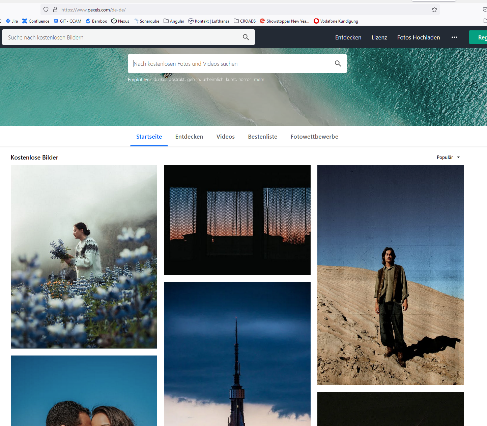

# Task

https://solidifying-thoughts.notion.site/React-Developer-Gallery-Task-2-4-hours-75f5b64d9cb048f48a952abd8c9ce3c0

So far only developed component using storybook.

The main goal was to start building the component for X hours under the condition of NOT producing any waster due to "open" requirement questions.

## Run

    npm run storybook

## Given Requirements

### Navigate, Equal Width

*Your Gallery should be able to navigate through a flexible number of equal width items* 

Just one row? Height could be different, see example image 

### Different Content

*The items should be able to display different kinds of contents. These contents are determined by the Parent Component.*

I simply used image URLs now to get started. As the content is defined by parent component, I would switch to a way of injecting html or similar into the gallery. React seems to have `props.chilren` for these things.

### Displayed Item Count

*The number of items that fit the screen width changes based on the screen size*

 If there is a common understanding of 'small' 'medium' 'large', would work with those definitions. For now it is proven to support multiple values (passed via props, so it is visible via storybook testing)

### Full Width vs. indent

*For now the gallery should support two different variants (full width, 60px indent)*

 Right now takes up 100% of available space. If indent is needed can be achieved via CSS-classes. If 60px is a somewhat standard classes would be available to quickly assign to our gallery component

### Different Sources

*The gallery's data will later be provided by different sources (Redux Store, API, ...)*

If the requirement is to display a list of items from the same template, but with different data, coming from a pageable query we can achieve that well.

If it must be different templates and different data (sources):
    Probably the largest required refractor for this part. Would achieve by providing a hook for a 'pageChange' (e.g. user clicks forward/backward). The parent component responsible for the input would then simply update the gallery's `props.children`. Also it can take necessary caching actions and decide, if at all we need to be asynchronous.

    Since the items would be up to the parent component they can be any regular HTML/React-Component and get their data once necessary. For that to work they cannot be too data-intensive as latency might make a bad impression on the user. However we can tackle that by pre-loading out of sight if necessary.

## Other Requirements

* Shall the gallery 'cycle through'?
  * If yes, with visible start/end or infinitely in a loop?
* Automatic cycling every X seconds?
* Animations?

## Next Steps

1. Check in with requirements again
2. Check for a finished React library ;P
3. Get UI/UX draft
4. Inject the gallery items from a parent component.
5. That enables us to check for a templating possibilty.
6. 'Inject' ScreenSize to supply `itemPerPage` property
